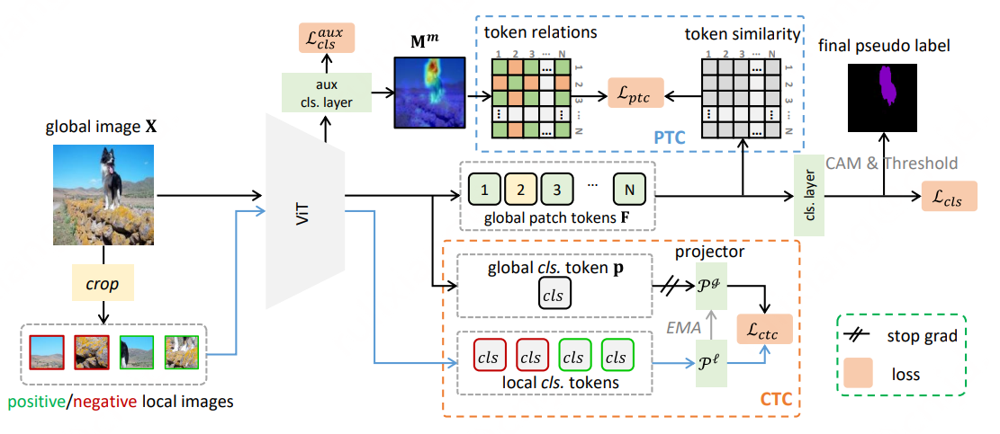

## Token Contrast for Weakly-Supervised Semantic Segmentation

Code of CVPR 2023 paper: Token Contrast for Weakly-Supervised Semantic Segmentation.

[[arXiv]](https://arxiv.org/abs/2303.01267) [[Poster]](https://rulixiang.github.io/assets/files/CVPR2023_TOCO_poster.pdf)

<div align="center">

<br>
  
</div>

<!-- ## Abastract -->

We proposed Token Contrast to address the over-smoothing issue and further leverage the virtue of ViT for the Weakly-Supervised Semantic Segmentation task.

## Data Preparations
<details>
<summary>
VOC dataset
</summary>

#### 1. Download

``` bash
wget http://host.robots.ox.ac.uk/pascal/VOC/voc2012/VOCtrainval_11-May-2012.tar
tar –xvf VOCtrainval_11-May-2012.tar
```
#### 2. Download the augmented annotations
The augmented annotations are from [SBD dataset](http://home.bharathh.info/pubs/codes/SBD/download.html). Here is a download link of the augmented annotations at
[DropBox](https://www.dropbox.com/s/oeu149j8qtbs1x0/SegmentationClassAug.zip?dl=0). After downloading ` SegmentationClassAug.zip `, you should unzip it and move it to `VOCdevkit/VOC2012`. The directory sctructure should thus be 

``` bash
VOCdevkit/
└── VOC2012
    ├── Annotations
    ├── ImageSets
    ├── JPEGImages
    ├── SegmentationClass
    ├── SegmentationClassAug
    └── SegmentationObject
```
</details>

<details>

<summary>
COCO dataset
</summary>

#### 1. Download
``` bash
wget http://images.cocodataset.org/zips/train2014.zip
wget http://images.cocodataset.org/zips/val2014.zip
```
#### 2. Generating VOC style segmentation labels for COCO
To generate VOC style segmentation labels for COCO dataset, you could use the scripts provided at this [repo](https://github.com/alicranck/coco2voc). Or, just download the generated masks from [Google Drive](https://drive.google.com/file/d/147kbmwiXUnd2dW9_j8L5L0qwFYHUcP9I/view?usp=share_link).

I recommend to organize the images and labels in `coco2014` and `SegmentationClass`, 

``` bash
MSCOCO/
├── coco2014
│    ├── train2014
│    └── val2014
└── SegmentationClass
     ├── train2014
     └── val2014
```


</details>

## Create environment
I used docker to build the enviroment.
``` bash 
## build docker
docker bulid -t toco --network=host -< Dockerfile

## activate docker
docker run -it --gpus all --network=host --ipc=host -v $CODE_PATH:/workspace/TOCO -v /$VOC_PATH:/workspace/VOCdevkit -v $COCO_ANNO_PATH:/workspace/MSCOCO -v $COCO_IMG_PATH:/workspace/coco2014 toco:latest /bin/bash
```

### Clone this repo

```bash
git clone https://github.com/rulixiang/toco.git
cd toco
```

### Build Reg Loss

To use the regularized loss, download and compile the python extension, see [Here](https://github.com/meng-tang/rloss/tree/master/pytorch#build-python-extension-module).
### Train
To start training, just run:
```bash
## for VOC
CUDA_VISIBLE_DEVICES=0,1 python -m torch.distributed.launch --nproc_per_node=2 --master_port=29501 scripts/dist_train_voc_seg_neg.py --work_dir work_dir_voc
## for COCO
CUDA_VISIBLE_DEVICES=0,1,2,3 python -m torch.distributed.launch --nproc_per_node=4 --master_port=29501 scripts/dist_train_coco_seg_neg.py --work_dir work_dir_coco
```
### Evalution
To evaluation:
```bash
## for VOC
python tools/infer_seg_voc.py --model_path $model_path --backbone vit_base_patch16_224 --infer val
## for COCO
CUDA_VISIBLE_DEVICES=0,1,2,3 python -m torch.distributed.launch --nproc_per_node=4 --master_port=29501 tools/infer_seg_voc.py --model_path $model_path --backbone vit_base_patch16_224 --infer val
```
<!-- You should get the training logs by running the above commands. Also, check our training log under `logs/`. -->

## Results
Here we report the performance on VOC and COCO dataset. `MS+CRF` denotes multi-scale test and CRF processing.

|Dataset|Backbone|*val*|Log|Weights|*val* (with MS+CRF)|*test* (with MS+CRF)|
|:---:|:---:|:---:|:---:|:---:|:---:|:---:|
|VOC|DeiT-B|68.1|[log](./logs/toco_deit-b_voc_20k.log)|[weights](https://drive.google.com/drive/folders/18Ya0w-CwSFKgzS7gTecpqMn0qgfdf1tu?usp=share_link)|69.8|70.5|
|VOC|ViT-B|69.2|[log](./logs/toco_vit-b_voc_20k.log)|[weights](https://drive.google.com/drive/folders/18Ya0w-CwSFKgzS7gTecpqMn0qgfdf1tu?usp=share_link)|71.1|72.2|
|COCO|DeiT-B|--|[log](./logs/toco_deit-b_coco_80k.log)|[weights](https://drive.google.com/drive/folders/18Ya0w-CwSFKgzS7gTecpqMn0qgfdf1tu?usp=share_link)|41.3|--|
|COCO|ViT-B|--|[log](./logs/toco_vit-b_coco_80k.log)|[weights](https://drive.google.com/drive/folders/18Ya0w-CwSFKgzS7gTecpqMn0qgfdf1tu?usp=share_link)|42.2|--|


## Citation
Please kindly cite our paper if you find it's helpful in your work.

``` bibtex
@inproceedings{ru2023token,
    title = {Token Contrast for Weakly-Supervised Semantic Segmentation},
    author = {Lixiang Ru and Heliang Zheng and Yibing Zhan and Bo Du}
    booktitle = {CVPR},
    year = {2023},
  }
```

## Acknowledgement

We mainly use [ViT-B](https://github.com/huggingface/pytorch-image-models/blob/main/timm/models/vit.py) and [DeiT-B](https://github.com/huggingface/pytorch-image-models/blob/main/timm/models/deit.py) as the backbone, which are based on [timm](https://github.com/huggingface/pytorch-image-models). Also, we use the [Regularized Loss](https://github.com/meng-tang/rloss). Many thanks to their brilliant works!
